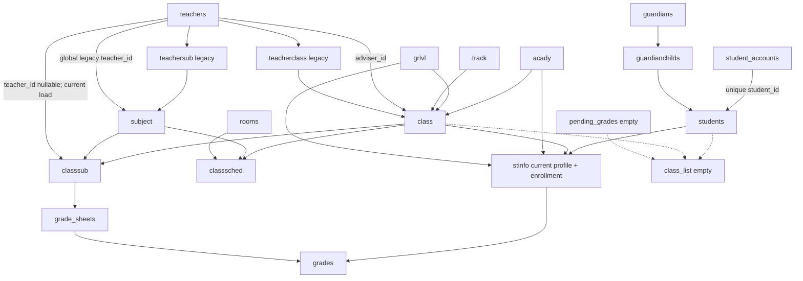
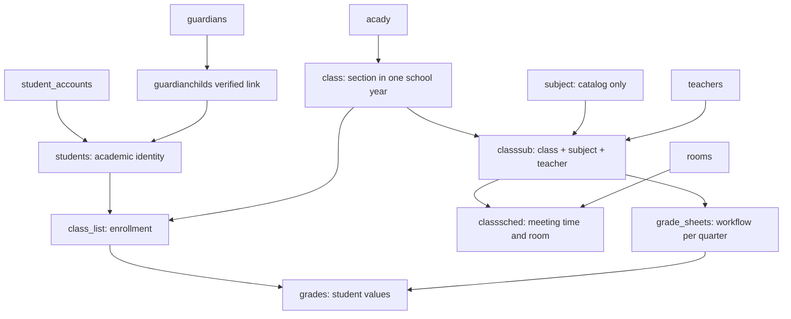

# GSYS database relationship and duplicate table audit

Audit date: 2026-09-18  
Database inspected: live MySQL database configured by this Laravel application  
Scope: read-only schema, row, orphan, duplicate, and application usage audit

## Executive findings

1. The Teacher Load screen is currently accurate for its authoritative source. `classsub` has 61 rows, zero non-null `teacher_id` values, and therefore reports 0 assigned and 61 unassigned.
2. This is also a legacy-data mismatch. `teacherclass` has 6 rows and `teachersub` has 15, but these are independent teacher-to-class and teacher-to-subject facts. Joining them identifies only 6 of the 61 class/subject rows. It cannot reconstruct the other 55 loads.
3. `subject.teacher_id` is populated for all 18 active subjects and can suggest a teacher for all 61 class/subject rows, but it is a global subject owner without class or school-year context. It is not safe evidence for automatic load assignment.
4. Runtime Teacher Portal and Grade Entry both read `classsub.teacher_id`, matching the Teacher Load page. The legacy `teacherclass` and `teachersub` tables are not read by runtime application code; only `CurriculumSeeder` writes them.
5. Student enrollment currently comes from `stinfo` (`student_id + class_id + acady_id + grlvl_id + admited`). All 61 records are admitted and logically valid. `class_list` exists, has zero rows, and is not used by runtime code.
6. `classsched` contains 40 schedule meetings. It stores class and subject plus day/time/room, but no teacher, academic year, or `classsub_id`. Twenty-five schedule rows have no matching `classsub` pair; 46 `classsub` rows have no schedule. Each scheduled class/subject pair currently has exactly one meeting.
7. There is one `subject` table and no `subjects` table. There is one `class_list` table and no `classlist` table.
8. The active grade workflow is `grade_sheets` plus `grades`. All 7 grade rows belong to one DRAFT sheet. `pending_grades` is empty and unused by runtime code. The old quarter columns in `grades` are present but null in all rows.
9. No duplicate relationship groups or logical orphans were found in the checked live rows. The main integrity risk is the near-total absence of database foreign keys and several missing unique constraints.
10. No tables or data were deleted, renamed, merged, or migrated during this audit.

## Complete database inventory

“FK” distinguishes declared database constraints from logical references that the application currently relies on. Only domain FKs on `student_accounts.student_id` and `grades.grade_sheet_id` are declared in the live schema.

| Table | Rows | Purpose | Primary key | Important FK or logical references | Used by code? | Overlap and recommendation |
|---|---:|---|---|---|---|---|
| `acady` | 4 | Academic years | `id` | none declared | Yes | **KEEP**; authoritative academic year catalog. |
| `agreement_records` | 0 | Registration legal acceptance log | `id` | logical account type/id | Yes, registration writes | **KEEP**; audit/legal data, no academic overlap. |
| `audit_events` | 5 | Account and grade workflow audit trail | `id` | polymorphic logical target | Yes, read/write | **KEEP**. |
| `batch` | 5 | Curriculum batch/year setup | `id` | logical `curriculum_id`, `track_id` | Yes | **KEEP BUT CLARIFY PURPOSE**; overlaps curriculum selection, not class enrollment. |
| `cache` | 5 | Laravel cache | `key` | none | Framework | **KEEP**. |
| `cache_locks` | 0 | Laravel cache locks | `key` | none | Framework | **KEEP**. |
| `class` | 8 | Section/class for one grade, track, academic year, adviser | `id` | logical `grlvl`, `track`, `acady`, `teachers` | Yes, read/write | **KEEP**; authoritative class/year container. |
| `classsched` | 40 | Class/subject meeting day, time, room | `id` | logical `class`, `subject`, `rooms` | Yes, admin writes; student/admin read | **KEEP BUT CHANGE LINKAGE** to `classsub`; 25 rows need reconciliation first. |
| `classsub` | 61 | Subjects offered to a class; nullable teacher is current teaching load | `id` | logical `class`, `subject`, `teachers` | Yes, read/write across admin/teacher/student/grades | **KEEP**; authoritative Class Subject and Teacher Load row. Add constraints after review. |
| `class_list` | 0 | Legacy intended Student-to-Class membership | `id` | logical `students`, `class` | No runtime use | **KEEP BUT CHANGE PURPOSE** if adopted as normalized enrollment; otherwise deprecate after the target is chosen. |
| `curriculum` | 3 | Named curriculum, linked to track/batch | `id` | logical `track`, `batch` | Yes, configuration | **KEEP**; curriculum definition, not actual class subject delivery. |
| `curriculum_subjects` | 34 | Subject requirements by curriculum, grade, semester | `id` | logical `curriculum`, `subject` | Yes, configuration read/write | **KEEP**; eligibility/template source. Unique identity already enforced. |
| `failed_jobs` | 0 | Laravel failed queue jobs | `id` | none | Framework | **KEEP**. |
| `grades` | 7 | Per-student, subject, class, year, quarter grade row | `id` | declared `grade_sheet_id -> grade_sheets.id`; other links logical | Yes, read/write | **KEEP**; authoritative grade values. Retire unused legacy fields after a later migration. |
| `grade_encoding_schedules` | 3 | Encoding window by year and quarter | `id` | logical `acady`, users | Yes, read/write | **KEEP**; unique year/quarter is enforced. |
| `grade_sheets` | 1 | Grade workflow header and immutable context snapshot | `id` | logical teacher/class/subject/year/grade level | Yes, read/write | **KEEP**; authoritative DRAFT/SUBMITTED/RETURNED/APPROVED lifecycle. |
| `grlvl` | 6 | Grade-level catalog | `id` | none | Yes | **KEEP**. |
| `guardianchilds` | 61 | Guardian claim/link to academic student | `id` | logical `guardians`, `students`, verifier user | Yes, read/write | **KEEP**; authoritative Guardian Child relationship. Pair uniqueness is enforced. |
| `guardians` | 31 | Guardian portal accounts | `id` | logical staff audit columns | Yes | **KEEP**. |
| `jobs` | 0 | Laravel queue | `id` | none | Framework | **KEEP**. |
| `job_batches` | 0 | Laravel queue batches | `id` | none | Framework | **KEEP**. |
| `migrations` | 21 | Laravel migration history | `id` | none | Framework | **KEEP**. |
| `model_has_permissions` | 0 | Spatie direct permission assignments | composite | declared `permissions` FK | Framework/application auth | **KEEP**. |
| `model_has_roles` | 1 | Spatie role assignments | composite | declared `roles` FK | Framework/application auth | **KEEP**. |
| `password_reset_tokens` | 0 | Laravel password reset tokens | `email` | none | Framework | **KEEP**. |
| `pending_grades` | 0 | Legacy independent pending-grade copy | `id` | logical `class_list`, `subject`, staff | No runtime use | **MIGRATE/DEPRECATE**; empty now, superseded by `grade_sheets.status`. |
| `permissions` | 3 | Permission tree | `id` | declared self-FK `parent_id` | Yes | **KEEP**. |
| `roles` | 2 | Role catalog | `id` | none | Yes | **KEEP**. |
| `role_has_permissions` | 3 | Role permission pivot | composite | declared `roles`, `permissions` FKs | Yes | **KEEP**. |
| `rooms` | 6 | Room catalog | `id` | none | Yes | **KEEP**. |
| `sessions` | 1 | Laravel sessions | `id` | none | Framework | **KEEP**. |
| `stinfo` | 61 | Academic student profile plus current enrollment placement | `id` | logical `students`, `grlvl`, `class`, `acady` | Yes, read/write | **KEEP BUT SPLIT PURPOSE LATER** if `class_list` becomes enrollment. Current enrollment authority. |
| `students` | 61 | Stable academic student identity and permanent student number; old credential columns remain | `id` | none declared | Yes | **KEEP**; authoritative academic student identity. |
| `student_accounts` | 61 | Student portal credentials and account-to-academic-record link | `id` | declared unique FK `student_id -> students.id` RESTRICT | Yes | **KEEP**; account data is separate from enrollment. |
| `subcat` | 5 | Subject category catalog | `id` | none | Yes | **KEEP**. |
| `subject` | 18 | Subject catalog; also contains legacy global `teacher_id` | `id` | logical `subcat`, `teachers` | Yes | **KEEP**, then deprecate `teacher_id` after loads are reconciled. No duplicate `subjects` table exists. |
| `teacherclass` | 6 | Legacy independent Teacher-to-Class assignment | `id` | logical `teachers`, `class` | Seeder only | **MIGRATE DATA THEN DEPRECATE**; lacks subject context. |
| `teachers` | 12 | Teacher portal accounts/identity | `id` | logical staff audit columns | Yes | **KEEP**. |
| `teachersub` | 15 | Legacy independent Teacher-to-Subject assignment | `id` | logical `teachers`, `subject` | Seeder only | **MIGRATE DATA THEN DEPRECATE**; lacks class/year context. |
| `track` | 4 | Academic track catalog | `id` | none | Yes | **KEEP**. |
| `tracksub` | 16 | Subject eligibility/template by track and grade level | `id` | logical `track`, `grlvl`, `subject` | Yes, configuration read/write | **KEEP OR MIGRATE INTO CURRICULUM SUBJECTS** after curriculum policy review; it overlaps curriculum templates, not delivered loads. |
| `users` | 1 | Staff/admin accounts | `id` | none | Yes | **KEEP**. |

## Source of truth by feature

| Feature | Read source | Write source | Finding |
|---|---|---|---|
| Admin Teacher Load assigned list | `classsub` where `teacher_id` is not null | `classsub.teacher_id` | Consistent. |
| Admin Teacher Load unassigned list | `classsub` where `teacher_id` is null | Assign action updates the same row; creates a `classsub` only if the class/subject pair is missing | Consistent. |
| Teacher dashboard / My Load | `classsub.teacher_id` | Admin Teacher Load | Consistent. |
| Teacher Grade Entry authorization | `classsub` matching teacher + class + subject; year comes from `class.acady_id` | Grades to `grade_sheets` and `grades` | Consistent. |
| Teacher Grade Entry roster | admitted `stinfo` matching class + year + grade level and a valid `students` row | Academic student management | Consistent with current enrollment model. |
| Student Subjects | account -> `students` -> `stinfo` -> `class` -> `classsub` | Class subject configuration and Teacher Load | Consistent. |
| Student teacher display | `classsub.teacher_id` | Teacher Load | Consistent; currently shows unassigned for all subjects. |
| Student schedule | `classsched` matching the student's class, then matches by subject ID in the view | Class Schedule | Partially disconnected: 25 schedule rows lack a `classsub`. |
| Guardian academic access | verified `guardianchilds.student_id` -> same `students` and grade chain | Guardian review | Consistent; currently all 61 links are PENDING. |
| Grade workflow | `grade_sheets` header/status + `grades` detail | Teacher Grade Entry and admin approval | Consistent. `pending_grades` is bypassed. |
| Curriculum planning | `curriculum_subjects` and `tracksub` | Curriculum/Track configuration | These define templates; they do not assign a teacher or enroll a student. |

Relevant implementation locations:

- Teacher Load queries and writes: `app/Http/Controllers/TeacherLoadController.php`.
- Teacher load authorization: `app/Services/GradeWorkflow.php`.
- Teacher class/roster/grade writes: `app/Http/Controllers/TeacherGradeController.php`.
- Teacher, student, and guardian portal queries: `app/Http/Controllers/PortalPageController.php` and `app/Http/Controllers/PortalGradeController.php`.
- Schedule writes: `app/Http/Controllers/ClassScheduleController.php`.
- Class Subject writes: `app/Http/Controllers/SchoolClassController.php`.
- Legacy `teacherclass`/`teachersub` writes: `database/seeders/CurriculumSeeder.php`; no runtime reads were found.

## Why Teacher Load shows 0 assigned and 61 unassigned

The two lists come from the same table and differ only by nullability:

```text
Assigned Teaching Loads = classsub WHERE teacher_id IS NOT NULL
Unassigned Class Subjects = classsub WHERE teacher_id IS NULL
```

Live result:

```text
classsub total       61
assigned              0
unassigned           61
```

The Assign action updates `classsub.teacher_id`. Teacher Portal and Grade Entry also read `classsub.teacher_id`. There is no current write/read split between those active modules.

The historical tables explain why the result may look surprising:

```text
teacherclass rows     6
teachersub rows      15
classsub rows        61

classsub rows with exactly one teacher supported by BOTH
teacherclass and teachersub: 6

classsub rows with no teacher supported by that joint evidence: 55
```

Classification: **the 0/61 screen is valid for the current authoritative relationship, while the database also contains incomplete legacy assignments elsewhere**. Automatically cross-joining the two legacy tables would invent teaching loads. The six jointly supported rows are migration candidates, not automatic truth, until an administrator confirms them. The 55 remaining rows require explicit assignment or another verified source.

## Duplicate and integrity checks

### Duplicate groups found

All checks returned zero duplicate groups:

- `classsub`: class + subject
- `teacherclass`: teacher + class
- `teachersub`: teacher + subject
- `classsched`: class + subject + day + room + start + end
- `class_list`: student + class
- `stinfo`: student; and student + class + academic year
- `guardianchilds`: guardian + student
- `tracksub`: track + grade level + subject
- `curriculum_subjects`: curriculum + subject + grade + semester
- `grades`: student + subject + class + year + quarter
- `grade_sheets`: teacher + class + subject + year + quarter
- `pending_grades`: class-list row + subject + status

### Logical orphan rows found

All checked orphan counts were zero for:

- `classsub` -> class, subject, teacher
- `classsched` -> class, subject
- `stinfo` -> student, class, academic year
- `guardianchilds` -> guardian, student
- `teacherclass` -> teacher, class
- `teachersub` -> teacher, subject
- current `grades` -> student, class, subject, academic year, teacher

### Schedule relationship gaps

These are relationship gaps rather than exact duplicate rows:

- 25 of 40 `classsched` rows have no matching class + subject row in `classsub`.
- 46 of 61 `classsub` rows have no schedule.
- 15 class/subject pairs currently appear in both tables.
- All 40 scheduled pairs currently have one meeting each, although the schema permits multiple meetings.

### Enrollment and guardian state

- `stinfo`: 61 total, 61 admitted, no null student/class/year references.
- `class_list`: 0 rows.
- `guardianchilds`: 61 total, all 61 PENDING, none VERIFIED.
- Student accounts: 61 linked one-to-one to 61 academic students.

### Grade state

- `grade_sheets`: 1 DRAFT sheet.
- `grades`: 7 rows, all linked to that sheet and using the current per-quarter columns.
- `grades.class_list_id`: null for all 7 rows.
- Legacy `first_quarter`, `second_quarter`, and `third_quarter`: null for all 7 rows.
- `pending_grades`: 0 rows.

## Current relationship map



## Recommended relationship map

This uses existing table names and avoids adding another Teacher Load table.



`class.acady_id` supplies the school-year component of both the teaching load and enrollment. If policy permits moving a section between years, the application must continue blocking that change once loads, enrollments, schedules, or grades exist.

## Authoritative targets

| Domain | Current authority | Recommended authority |
|---|---|---|
| Academic student identity | `students` | `students` |
| Portal account link | `student_accounts.student_id` | `student_accounts.student_id` |
| Student enrollment | `stinfo` placement fields | `class_list` after adding year/status and migrating verified rows; retain `stinfo` for profile data |
| Class Subjects | `classsub (class_id, sub_id)` | `classsub` |
| Teacher Load | `classsub.teacher_id` plus the class year | `classsub.teacher_id` plus the class year |
| Schedule | `classsched (class_id, subject_id, time/room)` | `classsched` linked to `classsub.id` |
| Guardian Child | `guardianchilds` | `guardianchilds` with VERIFIED required for portal access |
| Grade workflow | `grade_sheets` + `grades` | `grade_sheets` + `grades` |
| Curriculum templates | `curriculum_subjects` and `tracksub` | Prefer `curriculum_subjects`; review whether `tracksub` still carries distinct policy before migration |

## Safe consolidation plan for a later phase

No step below was executed during this audit.

1. **Confirm six legacy load candidates.** Produce an administrator review screen/report for the six `classsub` rows supported by both `teacherclass` and `teachersub`. Explicitly assign the other 55 rows. Do not use `subject.teacher_id` as automatic proof.
2. **Enforce Class Subject identity.** After confirming no duplicates, add unique `(class_id, sub_id)` and foreign keys to `class`, `subject`, and `teachers`. Keep `teacher_id` nullable so curriculum setup can precede staffing.
3. **Connect schedules to loads.** Review the 25 schedule rows with no `classsub`; either create the missing class subject after confirmation or correct/remove the schedule through normal admin workflow. Add `classsub_id` to `classsched`, backfill all 40 rows, then require it. Keep multiple rows per load to support multiple weekly meetings.
4. **Normalize enrollment.** Add `academic_year_id`, admission/status fields, timestamps, foreign keys, and an appropriate unique key to `class_list`. Copy the 61 verified placements from `stinfo`, compare counts and orphans, switch roster/portal/report queries, then remove enrollment fields from `stinfo` only in a later release.
5. **Retire legacy teacher mappings.** Once every active `classsub` is deliberately assigned and all readers use it, stop seeding `teacherclass`, `teachersub`, and `subject.teacher_id`. Deprecate them for at least one release before removal.
6. **Retire the old grade path.** Because `pending_grades` is empty, prevent future writes, document `grade_sheets.status` as the only workflow state, then remove `pending_grades` and obsolete `grades.class_list_id`/old quarter columns only after backups and compatibility checks.
7. **Resolve template overlap.** Compare all `tracksub` rows with `curriculum_subjects`. Migrate only after deciding whether grade, semester, units, ordering, prerequisites, and curriculum versioning are required. Do not confuse templates with delivered `classsub` rows.

## Constraints needed after data review

- `classsub`: unique `(class_id, sub_id)`; FKs for class, subject, teacher.
- `classsched`: FK to `classsub` and room; add collision rules based on actual scheduling policy. Avoid a uniqueness rule that prevents multiple weekly meetings.
- `class`: FKs for grade level, track, academic year, adviser. Reconsider global unique `name`; the application validates name within grade/year, while the database currently makes it globally unique.
- `class_list`: FKs for student, class, academic year and a unique enrollment identity such as `(student_id, academic_year_id)` if one class per year is the rule.
- `stinfo`: unique `student_id` while it remains a one-to-one profile; FKs to `students` and retained catalogs.
- `guardianchilds`: existing unique `(guardian_id, student_id)` is good; add guardian/student/verifier FKs.
- `teacherclass`, `teachersub`, `tracksub`: add uniqueness only if they remain during transition.
- `grade_sheets`: existing unique teacher/class/subject/year/quarter is good; add logical FKs after historical-row review.
- `grades`: existing unique student/subject/class/year/quarter is good; retain the restrictive sheet FK and add remaining logical FKs after historical-row review.
- `curriculum_subjects`, `student_accounts`, `grade_encoding_schedules`: current unique identities are appropriate.

## Laravel code requiring later updates

- Enrollment migration: `StudentInfo` relations and queries in `TeacherGradeController`, `PortalPageController`, `PortalGradeController`, report controllers, and academic student routes/controllers.
- Schedule linkage: `ClassSchedule` model, `ClassScheduleController`, schedule admin view, and student subjects view.
- Legacy load retirement: `Teacher`/`Subject` legacy relationships, curriculum seeder, and any configuration view that displays `subject.teacher_id`.
- Grade legacy retirement: grade migration/model/report compatibility code; no runtime `pending_grades` reader or writer currently exists.
- Database constraints: controllers should convert constraint violations into validation messages, while retaining transaction and authorization checks.

## Risks before consolidation

1. The six legacy load candidates may reflect seed assumptions rather than real staffing decisions.
2. Global `subject.teacher_id` can silently assign one teacher to every class offering a subject and must not be treated as class/year evidence.
3. Twenty-five schedule rows would become invalid if a schedule-to-load FK were added before reconciliation.
4. Moving enrollment away from `stinfo` can make teacher rosters, student subjects, guardian grades, and reports disappear if readers are switched before all 61 placements are copied and verified.
5. Removing legacy grade columns too early may break imports or external code not present in this repository.
6. Adding foreign keys may fail on type differences (`int` versus `bigint unsigned`) even though there are currently no logical orphans.
7. Historical grade snapshots intentionally preserve names. Normalization must not overwrite those snapshots when catalog names change.
8. `class.name` has a database-wide unique index while application validation treats identity as grade/year scoped; future year reuse needs a deliberate constraint migration.

## Audit boundary

The audit queried schema metadata and aggregate/live relationship data only. It did not drop, delete, rename, merge, reassign, or backfill any database record.
